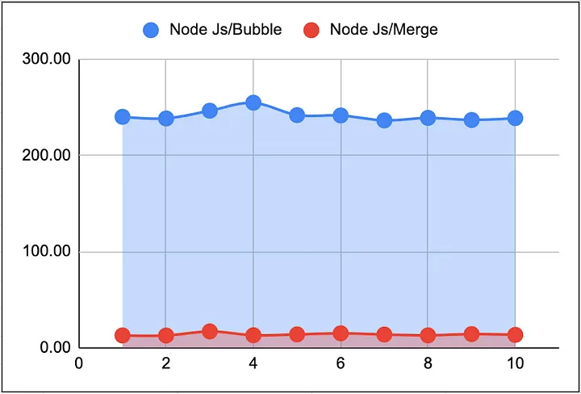
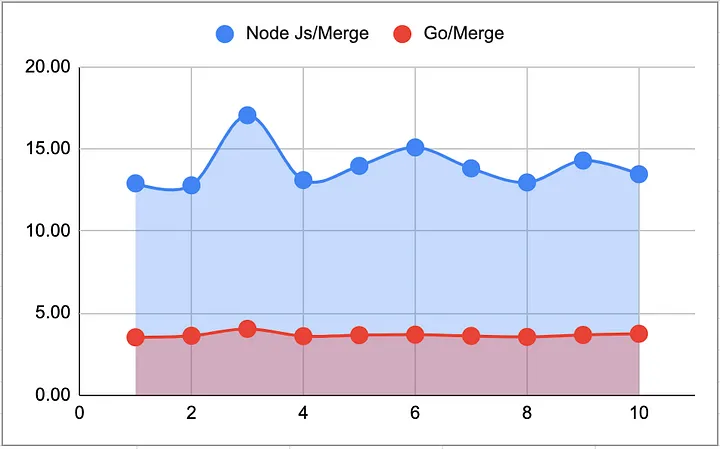
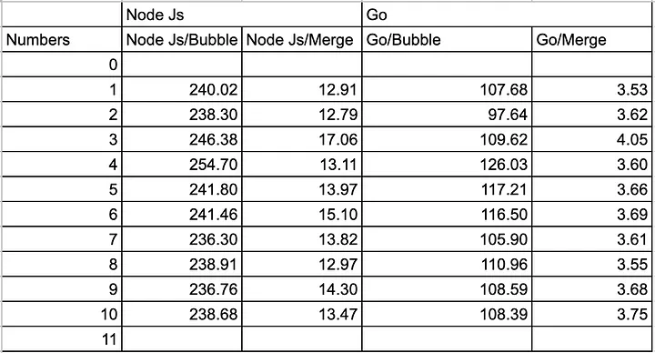

# Node.Js vs Go Which Has The Best Performance

## Benchmarking sorting algorithms, Bubble Sort and Merge Sort, using Node.js and Go


I have been getting much impressive news lately about the Golang language, including many Youtube videos comparing it against Node.js. In every one of those videos, people get to the conclusion that Go is an incredible language. Almost as fast as Rust and C but with the easy-to-develop features of Node.js, the best of both worlds!

So as a developer I decided to test things by myself. Then, searching for a fast way to test it I thought, what the best way to test the speed of a program than using the classic sorting algorithms?

The first thing I did was to create a Node.js script that would create a JSON file for me with an array of a custom length full of random numbers. This way I could make an example array of the length I wanted really fast. Then on each program, I would use this file to get the data I needed to sort, easy right?

```javascript
// Creates a file with an array of random numbers ready to be sorted!
const fs = require('fs')
const array = []
const ARRAY_LENGTH = process.argv[2] ? parseInt(process.argv[2]) : 1000

function fillArrayWithRandomNumbers(array, arrayLength = 1) {
  for (let index = 0; index < arrayLength; index++) {
  array.push(Math.floor(Math.random() * arrayLength))
 }
}

fillArrayWithRandomNumbers(array, ARRAY_LENGTH)
console.log(array)

fs.writeFile('./inputs/randomNumbersArray.json', JSON.stringify(array, null, 4), err => {
  if (err) console.error('Writing file error: ', err)
 else console.log(`File with array of length ${ARRAY_LENGTH} created!`)
})
```

After that, I started coding the Node.js example, the classic Bubble Sort first

```javascript
// BUBBLE SORT
function bubbleSort(array) {
 //Outer pass
 for (let i = 0; i < array.length; i++) {
  //Inner pass
  for (let j = 0; j < array.length - i - 1; j++) {
   //Comparing values in ascending order
   if (array[j + 1] < array[j]) {
    //Swapping values
    [array[j + 1], array[j]] = [array[j], array[j + 1]]
   }
  }
 }
 return array
}
```

The code is very straightforward, it receives an array, it loops through it comparing each position with the next and if the second is smaller than the first it exchanges the values, this process is repeated until the entire array is sorted out and then it returns it. It is a very slow process since it has to loop several times through the array.

Then Merge Sort

```javascript
// MERGE SORT
function merge(left, right) {
 const array = []
 // Break out of loop if any one of the array gets empty
 while (left.length && right.length) {
  // Pick the smaller among the smallest element of left and right sub arrays 
  if (left[0] < right[0]) {
   array.push(left.shift())
  } else {
   array.push(right.shift())
  }
 }
 // Concatenating the leftover elements
 // (in case we didn't go through the entire left or right array)
 return [...array, ...left, ...right]
}

function mergeSort(array) {
 const half = array.length / 2
 // Base case for exiting recursion
 if (array.length < 2) {
  return array
 }
 const left = array.splice(0, half)
 return merge(mergeSort(left), mergeSort(array))
}
```

This one is a little bit more difficult to explain, it follows the concept of divide and conquer. It splits the received array into two halves over and over using recursion and then compares and sorts these smaller arrays one against the other basically sorting the entire array in one go. It is the fastest sorting algorithm I know, the difference in performance and speed against the simple Bubble Sort it’s incredible.

Here we have a comparison graph, sorting ten arrays of 10000 numbers each, X-axis represents the attempt, and Y-axis represents the number of milliseconds needed by each algorithm to sort each entire array. As we can see Merge algorithm is incredibly faster and more stable than Bubble Sort.



But then it comes the question can we make the fastest algorithm even faster using Go?

```go
// MERGE SORT
func merge(left []int, right []int) []int {
 final := []int{}
 i := 0
 j := 0
 for i < len(left) && j < len(right) {
  if left[i] < right[j] {
   final = append(final, left[i])
   i++
  } else {
   final = append(final, right[j])
   j++
  }
 }
 for ; i < len(left); i++ {
  final = append(final, left[i])
 }
 for ; j < len(right); j++ {
  final = append(final, right[j])
 }
 return final
}

func mergeSort(array []int) []int {
 if len(array) < 2 {
  return array
 }
 left := mergeSort(array[:len(array)/2])
 right := mergeSort(array[len(array)/2:])
 return merge(left, right)
}
```

So this is my first time writing Go, so there are probably better ways to write this code, but I also tried to keep the logic as similar to the one in Node.js as possible. Not having a while loop in Go was a bit strange but in the end, a for loop was enough and as you can see the logic is the same as the one in Node.js, and the code itself it’s quite similar and easy to understand.

But when we go to the graph we can see how much more stable the Go algorithm is and the fact that all the time it takes almost a third of the time to sort each array than the Node.js one.



Here we have all the results of sorting the ten 10000 numbers arrays. All the times are in milliseconds and you can see the great difference between Node.js and Go.



Here you have the project on GitHub if you want to check the entire code and play around with it to change the tests.

[Github Node Js Vs Go Sorting Algorithms](https://github.com/Armando284/nodejs-vs-go-sorting-algorithms/)
